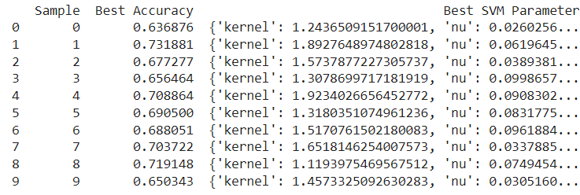
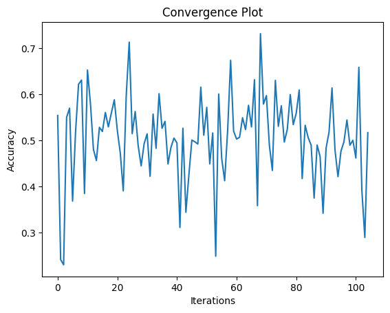

# Parameter-Optimization-102103550

## Yatharh Gautam

## 102103550

Group:3CO20
---

## Result Table



## Result Graph



## Overview

This report offers a comprehensive analysis of the [Dry Bean Dataset](https://archive.ics.uci.edu/ml/datasets/Dry+Bean+Dataset) (UCI ML Repository ID: 602).

## Methodology

1. **Data Loading**: The Dry Bean Dataset is loaded using the UCI ML Repository API.
2. **Data Preprocessing**: The dataset is split into features (X) and target (y). A train-test split is performed for model evaluation.
3. **Model Selection**: A Nu-Support Vector Classifier (NuSVC) with Bayesian Optimization is employed to optimize hyperparameters.
4. **Model Evaluation**: The model's accuracy is evaluated using cross-validation and convergence plots.
5. **Result Analysis**: The best hyperparameters and accuracy obtained are analyzed.

## Dataset Description

The Dry Bean Dataset comprises various attributes of dry beans, including geometric, shape, and texture attributes, used for bean classification.

### Features

The dataset includes the following features:

- **Area**
- **Perimeter**
- **MajorAxisLength**
- **MinorAxisLength**
- **AspectRatio**
- **Eccentricity**
- **ConvexArea**
- **EquivDiameter**
- **Extent**
- **Solidity**
- **Roundness**
- **Compactness**
- **ShapeFactor1**
- **ShapeFactor2**
- **ShapeFactor3**
- **ShapeFactor4**

### Target

The target variable represents the class of the dry bean.

## Data Exploration

Basic exploratory data analysis is performed:

### Summary Statistics

```python
# Summary statistics of the dataset
summary_statistics = X.describe()
print(summary_statistics)
```

```python
# Class distribution
class_distribution = y['Class'].value_counts()
print(class_distribution)
```

```python
import seaborn as sns
# Calculate correlation matrix
correlation_matrix = X.corr()
# Plot heatmap
plt.figure(figsize=(12, 8))
sns.heatmap(correlation_matrix, annot=True, cmap='coolwarm', fmt=".2f")
plt.title('Correlation Heatmap')
plt.show()
```


---
